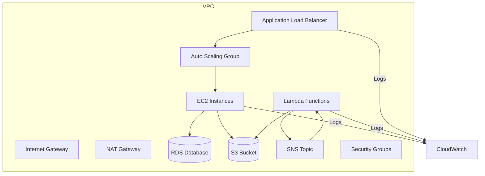

# Estudo-AWS-CloudFormation
# Estudo sobre uma Stack AWS CloudFormation

Este repositório foi criado como parte do **desafio de laboratório** de CloudFormation.  
O objetivo é implementar uma stack mínima em AWS, documentar o processo e compartilhar insights de aprendizado.

# O que é o AWS CloudFormation?

O **AWS CloudFormation** é um serviço que permite **descrever e provisionar recursos da AWS usando código** (YAML ou JSON).  
Com ele, conseguimos automatizar a criação de ambientes completos em nuvem, sem precisar clicar manualmente no console.

---

## Objetivos do Desafio

- Aplicar conceitos de **Infraestrutura como Código (IaC)** com AWS CloudFormation.  
- Documentar o processo técnico de forma clara e estruturada.  
- Utilizar o **GitHub** como ferramenta de estudo e compartilhamento.  
- Criar um material de apoio que sirva como referência para futuros projetos.  

---

## Arquitetura da Stack

Essa stack é um **modelo clássico de aplicação web/API em nuvem**, que inclui:

- **Escalabilidade** → Auto Scaling Group + Load Balancer  
- **Segurança** → VPC isolada, Subnet e Security Groups  
- **Banco de Dados** → Amazon RDS (MySQL)  
- **Armazenamento** → Amazon S3  
- **Serverless** → AWS Lambda  
- **Mensageria** → Amazon SNS  
- **Monitoramento** → Amazon CloudWatch  

---

## Diagrama da Stack

## Template CloudFormation

O arquivo `template.yaml` contém a definição da infraestrutura descrita neste repositório.  
Ele provisiona recursos como VPC, Subnet, Internet Gateway, NAT Gateway e configurações básicas para uma arquitetura escalável.

> Este template é usado como base para estudo e não está pronto para produção.

