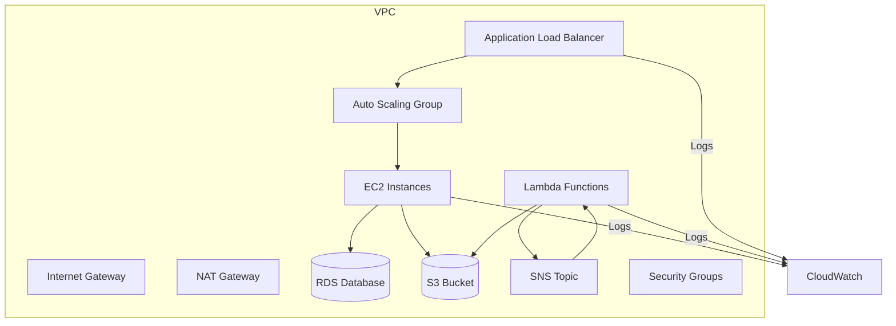

# Estudo-AWS-CloudFormation
# Estudo sobre uma Stack AWS CloudFormation

Este repositório foi criado como parte do **desafio de laboratório** de CloudFormation.  
O objetivo é implementar uma stack mínima em AWS, documentar o processo e compartilhar insights de aprendizado.

# O que é o AWS CloudFormation?

O **AWS CloudFormation** é um serviço que permite **descrever e provisionar recursos da AWS usando código** (YAML ou JSON).  
Com ele, conseguimos automatizar a criação de ambientes completos em nuvem, sem precisar clicar manualmente no console.

---

## Objetivos do Desafio

- Aplicar conceitos de **Infraestrutura como Código (IaC)** com AWS CloudFormation.  
- Documentar o processo técnico de forma clara e estruturada.  
- Utilizar o **GitHub** como ferramenta de estudo e compartilhamento.  
- Criar um material de apoio que sirva como referência para futuros projetos.  

---

## Arquitetura da Stack

Essa stack é um **modelo clássico de aplicação web/API em nuvem**, que inclui:

- **Escalabilidade** → Auto Scaling Group + Load Balancer  
- **Segurança** → VPC isolada, Subnet e Security Groups  
- **Banco de Dados** → Amazon RDS (MySQL)  
- **Armazenamento** → Amazon S3  
- **Serverless** → AWS Lambda  
- **Mensageria** → Amazon SNS  
- **Monitoramento** → Amazon CloudWatch  
Componentes e suas funções:
VPC (Virtual Private Cloud)
Cria uma rede isolada para os recursos da aplicação, garantindo controle sobre IPs, subnets e rotas.

Subnets públicas e privadas
Permitem separar recursos expostos à internet (como o Load Balancer) dos internos (como o banco de dados).

Internet Gateway e NAT Gateway
O Internet Gateway permite acesso público à internet, enquanto o NAT Gateway permite que instâncias privadas façam chamadas externas com segurança.

Security Groups
Controlam o tráfego de rede permitido para cada recurso, funcionando como firewalls virtuais.

Application Load Balancer (ALB)
Distribui o tráfego entre múltiplas instâncias EC2, garantindo alta disponibilidade e escalabilidade.

Auto Scaling Group (ASG)
Ajusta automaticamente a quantidade de instâncias EC2 com base na demanda, otimizando custo e performance.

Amazon EC2
Executa a aplicação principal em servidores virtuais configuráveis.

Amazon RDS (MySQL)
Banco de dados relacional gerenciado, usado para armazenar dados da aplicação com alta disponibilidade.

Amazon S3
Armazena arquivos estáticos, backups ou dados da aplicação de forma segura e escalável.

AWS Lambda
Executa funções serverless para tarefas específicas, como processamento de eventos ou integração com outros serviços.

Amazon SNS (Simple Notification Service)
Envia notificações automáticas para tópicos ou assinantes, útil para alertas e integrações.

Amazon CloudWatch
Monitora métricas e logs da aplicação, permitindo criar alarmes e visualizar o desempenho dos recursos.

---

## Diagrama da Stack
O diagrama abaixo representa visualmente como os componentes se conectam:

## Template CloudFormation

O arquivo `template.yaml` contém a definição da infraestrutura descrita neste repositório.  
Ele provisiona recursos como VPC, Subnet, Internet Gateway, NAT Gateway e configurações básicas para uma arquitetura escalável.

> Este template contém valores fictícios (como AMI e ARN) e não está pronto para produção.

